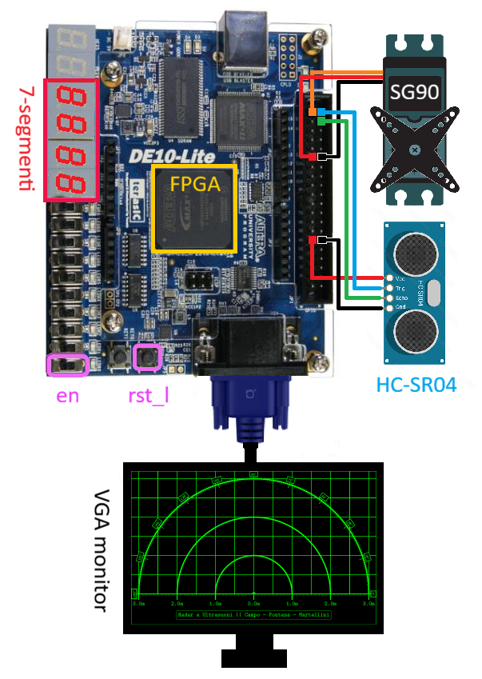

# RADAR – FPGA Ultrasonic Radar (Verilog)

Digital project written in **Verilog HDL** that implements an ultrasonic radar system on FPGA.

The design controls an ultrasonic distance sensor and a servomotor to perform angular scanning, processes the echo signal, and displays distance information on a VGA monitor.

This project is intended mainly for **educational and experimental purposes**, focusing on digital design, timing control, and FPGA-based signal processing.

---

## Features

- Ultrasonic sensor interface (trigger / echo)
- Servomotor control for angular scanning
- Digital distance measurement logic
- VGA output for radar-style visualization
- Modular Verilog design suitable for FPGA implementation
- Median filter to reject outliers

---

## Requirements

- FPGA development board (DE10-Lite equipped with MAX10 Altera FPGA)
- Ultrasonic sensor (e.g. HC-SR04 or compatible)
- Servomotor
- VGA-compatible display
- Quartus Prime 18.1

---

## License

This project is released under the **MIT License**.

---

## Author

**kasetron**  
Feel free to open issues or suggestions on GitHub.
